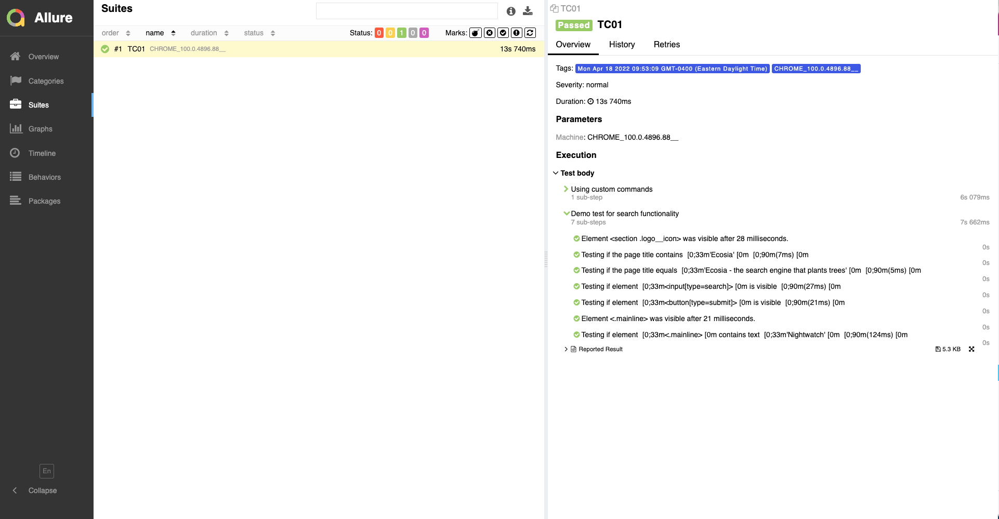
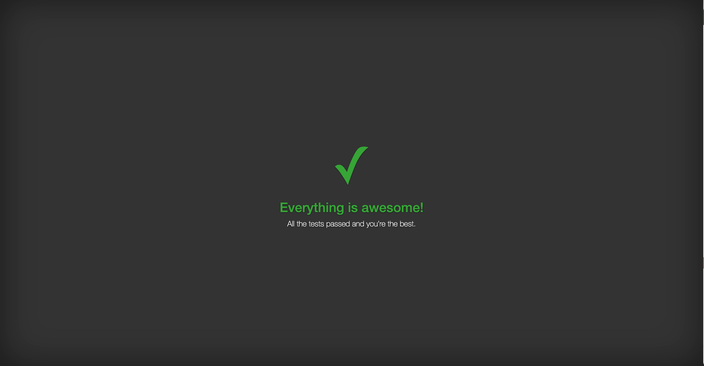
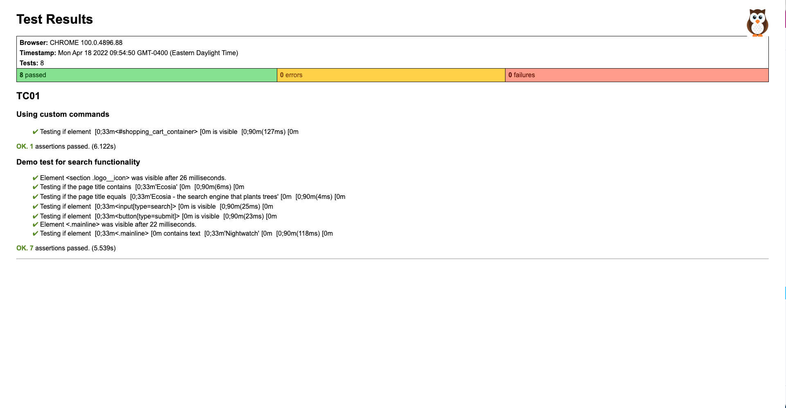

## Reports provided in this framework:
</br>

### `nightwatch-allure report`

After test execution: 
> npm run generateReport



</br>

### `nightwatch-html-report`
> npm run test1

</br>

**cover** theme sample



</br></br>

### `nightwatch-html-report by Denis Denisov`
> npm run test2



</br></br>

# How to implement reports

### 🧿 **`Allure Report`** 🧿

➡️  npm install nightwatch-allure

➡️ npm install -g allure-commandline

➡️  Add following code to globals file in nightwatch
```js
const allureReporter = require('nightwatch-allure');
module.exports = {
  reporter: (results,done)=>{
    const reporter = new allureReporter.NightwatchAllureReporter({});
    reporter.write(results,done);
  }
};
```
➡️  Create a new script in package.json file
```
"scripts": {
    ...
    "generateReport": "allure generate ./allure-results --clean && allure open",
    ...
  },
```
➡️  After test execution, enter `npm run generateReport`

</br>

### 🧿 **`Nightwatch HTML Reporter`** 🧿

➡️  npm install nightwatch-html-reporter

➡️  npm install -g nightwatch-html-reporter

➡️  Create a new file: `html-reporter.js` and add the following code
```
var HtmlReporter = require('nightwatch-html-reporter');

var reporter = new HtmlReporter({
    openBrowser: true,
    reportsDirectory: __dirname + '/html-report',
    // available themes: default / cover / compact / default-gray / compact-gray
    themeName: 'cover',
});

module.exports = {
    write: function (results, options, done) {
        reporter.fn(results, done);
    }
};
```
➡️  Create a new folder: `html-report`

➡️  Use `--reporter` option while running tests:  
> nightwatch --tag tagName `--reporter html-reporter.js`

➡️  Enter `Ctrl+C` in console after the HTML report is generated.

<br/>

### 🧿 **`HTML Reporter`** 🧿

➡️  npm install fs path handlebars

➡️  Create a new file: `html-reporter.js` and `html-reporter.hbs` in the root folder and copy the content from `html-reporter2.js` and `html-reporter2.hbs` files in the framework

➡️  Use `--reporter` option while running tests:  **nightwatch --reporter html-reporter.js**

➡️  Reports will be created under tests_output folder. 